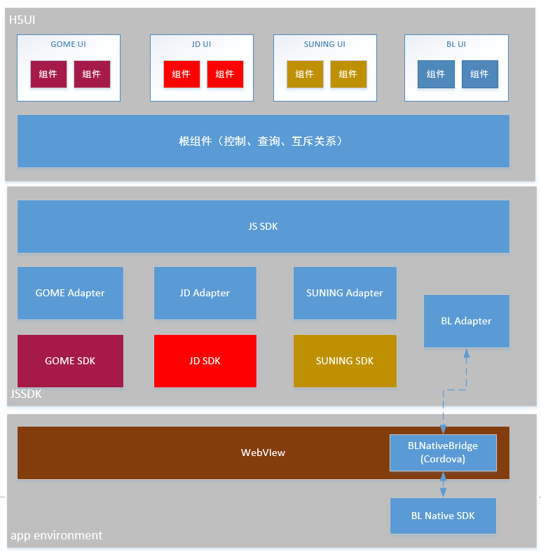

通用H5  JS SDK接口
=======================================

编写目的
==========

预期读者:

产品UI的开发者。（不包括平台Adapter）

背景说明

* 软件系统名称：基于 HTML5 的 UI 系统 的 JS SDK 部分。

* 描述 <接口> 接收来自平台 Adapter 的输出，转发给上层 UI，并将用户的操作转化为指令控制设备的行为。

组件分布图
============

运行环境
==========

因为该JSSDK中包含了多个平台的SDK与其对应adapter（国美&京东），所以需要运行在webpack的环境中使用resolve.alias指定adapter的路径

安装
==========
>npm install --save broadlink-jssdk

JS SDK类说明
=============

**ready()**
^^^^^^^^^^^^^^^^^^^^^^^

>`ready();`
	
功能说明:	启动函数，当 JSDK 就绪之后，调用启动函数。

输人项:	 无。

返回项: Promise，如jsdk初始化成功则resolved，否则rejected。Resolved会传入设备状态.
e.g: 
		
		
		.. code-block:: javascript
	
			var ready=JSDK.ready();
			ready.then(function(data){
			//data的数据格式如下:
			{
			'status':{
				'mark':1,
				'temp':25
				}
			//以下两个字段（'online','name'）不一定会存在，开发者需要根据平台的不同进行判断
			'online': '0/1/2/3',//设备状态:未知/本地/远程/离线(京东平台对应:在线/离线)
			'name':'refrigerator'
			}}).catch(function(error){// error为一个Error对象，数据格式如下:
			{
				message:‘网络超时’,//错误描述
				code:11,   //错误码
				msg:平台返回的错误信息
			}
			
			})

**setDeviceStatus()**
^^^^^^^^^^^^^^^^^^^^^^^^^^^^^^^^^^

	.. code-block:: javascript
	
		setDeviceStatus(cmd);
		
	
	
功能说明:	给设备发送命令

输人项:	 

* cmd：命令对象。
	
	.. code-block:: javascript
	
		{
		 'mark': 1,
		 'temp': 25
		}
	
返回项：

一个 Promise 对象,调用者可以这样使用：

	.. code-block:: javascript
	
		var prms = JSDK.setDeviceStatus(…);
		// 显示等待沙漏
		prms.then(function(data) {
		//受到平台的限制，不一定会传入data参数，如国美
		 //data是设备最新状态，数据结构为：
		 {
		
		 'status': {
			  'mark': 1,
			  'temp': 25
			 }
			 //以下两个字段（'online','name'）不一定会存在，开发者需要根据平台的不同进行判断
			 'online': '0/1/2/3',//设备状态:未知/本地/远程/离线(京东平台对应:在线/离线)
			 'name':'refrigerator'
		 }
		}).catch(function(error) {// error为一个Error对象，数据格式如下：
			{
				message:‘网络超时’,//错误描述
				code:11,   //错误码
				msg:平台返回的错误信息
			}
		});
		

**getDeviceStatus()**
^^^^^^^^^^^^^^^^^^^^^^^^^^^^^^^^^

	.. code-block:: javascript
		
		/*三种形式*/
		getDeviceStatus() 	//查询所有状态
		
		getDeviceStatus(params);//通过参数与值查询状态，多用于虚拟设备，如{ page:1}
		
		getDeviceStatus(array) //查询指定状态，如[‘pwr’,’temp’]

		
功能说明:	尝试更新设备状态

输人项:	 

* params：接口名称数组，可选。若不选，则获取所有接口状态。

* array参数数组. 若不选，则获取所有接口状态。

返回项：

一个 Promise 对象,调用者可以这样使用：

	.. code-block:: javascript
	
		var prms = JSDK.getDeviceStatus(…);
		// 显示等待沙漏
		prms.then(function(data) {
		//data是设备最新状态，数据结构为：
		{
		'status': {
			 'mark': 1,
			 'temp': 25
			},
		"online":"0/1/2/3",//设备状态:未知/本地/远程/离线(京东平台对应:在线/离线)
		'name':'refrigerator'
		}
		}).catch(function(error) {// error为一个Error对象，数据格式如下：
		{
			message:'网络超时',//错误描述
			code:11,//错误码
			msg:平台返回的错误信息
		}
		);
		
		
**onStatusChanged()**
^^^^^^^^^^^^^^^^^^^^^^^^^	
		
	.. code-block:: javascript
	
			onStatusChanged(callback) 	//返回变化的所有状态	
						
功能说明： 尝试更新设备状态
该方法在没有提供原生监听方法的平台上被调用后，会开启一个间隔为3秒的interval查询。如果callback为空，会停止该查询任务。

输入项：

callback: 状态变化后的回调函数，其参数为data,e.g:

	.. code-block:: javascript
	
			//平台有监听方法
			
			JSDK.onStatusChanged(function(data){
			//状态变化时回调自定义updateUI函数并传递data数据作为参数，
			//其中data数据格式如下：
			{
			'status':{
				'mark':1,
				'temp':25
				},
			'online': '0/1/2/3',
			'name':'refrigerator'			
			}
			
			//下面为处理更新UI的逻辑,
			//......
			//......
			}
			});
			
			
			//平台无监听方法
			
			JSDK.onStatusChanged(function(data){
			//该方法在调用时开启interval查询，此处data返回的依然是变化的数据，
			//状态变化时回调自定义updateUI函数并传递data数据作为参数，
			//其中data数据格式如下：
			{
			'status':{
				'mark':1,
				'temp':25
				},
			'online': '0/1/2/3',	
			'name':'refrigerator'			
			}
			
			//下面为处理更新UI的逻辑,
			//......
			//......
			}
			});
			//开启后，若需关闭interval查询，直接调用JSDK.onStatusChanged();
			
			
返回项：无
		
**getProfile()**
^^^^^^^^^^^^^^^^^^^^^^^^^

	.. code-block:: javascript
	
			getProfile();
			
功能说明:	获取设备profile

输人项:	

返回项：profile相关信息的JSON对象

数据格式为：

	.. code-block:: javascript
	
			{
			"ver": "1",
			"desc": {
				"pid": "00000000000000000000000028270000",//设备pid
				"vendor": "1023",
				"cat": "41",
				"model": "SP MINI2"//设备类型
				},
			"srvs": ["4.1.50"],
			"limits": {
				"tmrtsk": [8,1],
				"pertsk": [16,1]
				},
			"suids": [{
				"suid": "",
				"intfs": {//参数值类型描述
					"tmrtsk":[{
						"idx": 1,
						"in": [3],
						"act": 3
						}],
					"pwr":[{
						"idx": 1,
						"in": [1,0,1],
						"act": 3,
						"ifttt": 3
						}],
					"pertsk":[{
						"idx": 1,
						"in": [3],
						"act": 3
						}],
					"chargingprotect": [{
						"idx": 1,
						"in": [3],
						"act": 3
						}],
					"devtime": [{
						"idx": 1,
						"in": [3],
						"act": 1
						}],
					"pwrhistory": [{//历史数据
						"idx": 1,
						"in": [3],
						"act": 1
						}]
					}
				  }]
			}
				
		

**currentPlatform()**
^^^^^^^^^^^^^^^^^^^^^^^^^^^^^^^^^^

	.. code-block:: javascript
	
			currentPlatform();
		
		
功能说明:	获取当前运行在哪个平台

输人项:	 无

返回项： 枚举值（jd、ali、dna、gome）

**platformSDK()**
^^^^^^^^^^^^^^^^^^^

	.. code-block:: javascript
	
			platformSDK();
		
		
功能说明:		获取当前平台提供的sdk对象

输人项:	 无

返回项：平台SDK对象，如果是空则方法已暴露在window全局对象中

	**京东为: JDSMART对象**
	
	**国美为：new GS.Device()实例化之后的对象**
	
	**dna:cordova//《APP平台化框架_v1.7》中提供的接口**
